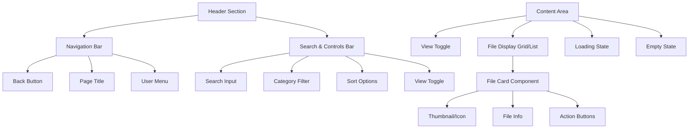

# Files Page UI Redesign Plan

## Current Analysis
The existing files page uses a simple grid layout with basic search and category filtering. It has good foundations with Framer Motion animations and dark mode support, but can be modernized with better visual hierarchy, enhanced interactions, and additional features.

## New Design Vision
A modern, intuitive file management interface with:
- Enhanced visual design with better spacing and typography
- Advanced animations and micro-interactions
- Improved file cards with thumbnails and better information display
- Flexible view options (grid/list)
- Better responsive design
- Enhanced loading and empty states

## Layout Structure



## Key Improvements

### 1. Enhanced Header
- Modern navigation bar with glassmorphism effect
- Integrated search with real-time filtering
- Advanced filter and sort controls
- View mode toggle (grid/list/table)

### 2. File Cards Redesign
- Larger, more spacious cards
- Image thumbnails for visual files
- Better typography hierarchy
- Action buttons with hover states
- File type indicators and badges

### 3. Advanced Animations
- Staggered entrance animations
- Smooth hover transitions
- Loading skeleton animations
- Micro-interactions for buttons

### 4. Responsive Design
- Mobile-first approach
- Adaptive grid layouts
- Touch-friendly interactions
- Optimized for all screen sizes

### 5. Enhanced States
- Skeleton loading screens
- Improved empty state with illustrations
- Error states with retry options
- Success feedback for actions

## Component Breakdown

### FileCard Component
```
┌─────────────────────────────────┐
│  ┌─────┐                        │
│  │Icon │  File Name             │
│  │/Thumb│  Size • Category      │
│  └─────┘  [Badges]              │
│                                 │
│  [Download] [Preview] [More]    │
└─────────────────────────────────┘
```

### Header Controls
- Search bar with magnifying glass icon
- Category dropdown with counts
- Sort dropdown (name, size, date, type)
- View toggle buttons (grid, list, table)

## Implementation Phases

1. **Phase 1: Foundation**
   - Update layout structure
   - Implement new header design
   - Create base FileCard component

2. **Phase 2: Enhancements**
   - Add thumbnail generation
   - Implement view modes
   - Enhance animations

3. **Phase 3: Polish**
   - Add micro-interactions
   - Optimize performance
   - Final responsive adjustments

## Technical Considerations

- Maintain existing API integrations
- Ensure accessibility (WCAG 2.1)
- Optimize for performance with large file lists
- Support for file type detection and preview
- Maintain dark mode compatibility

## Success Metrics

- Improved user engagement
- Better mobile experience
- Faster file discovery
- Enhanced visual appeal
- Maintained functionality